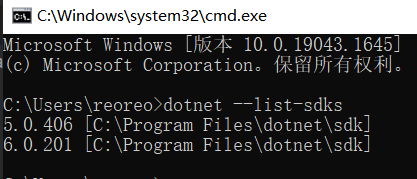
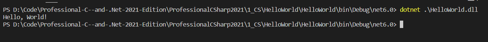

> 这章节内容包括
>
> * 从 .Net Framework 到 .Net Core 再到 .Net Terms
> * .Net 版本发布时间和长期支持问题（LTS）
> * 应用程序类型和应用
> * 开发人员工具
> * 使用 .Net CLI
> * 程序 "Hello World"
> * 创建 web 应用的技术

> 本章中的代码下载
>
> 本章的源代码可以在 www.wiley.com 的本书上找到。点击下载链接。代码也可以在 https://github.com/ProfessionalCSharp/ 上找到目录 `ProfessionalCSharp2021` 中的 `1_CS/HelloWorld` 。
>
> 本章的代码主要分为以下例子：
>
> ➤ HelloWorld
>
> ➤ WebApp
>
> ➤ SelfContainedHelloWorld

## 从 .Net Framework 到 .Net Core 再到 .Net 术语

.NET的第一个版本于2002年发布。自第一个版本以来，许多特性都发生了变化。.NET的第一个时代是.NET Framework，它为Windows桌面应用程序和Web应用程序提供了窗体开发。这个版本的.NET只适用于微软的Windows系统。当时，微软还在ECMA(https://www.ecma-international.org/publications/standards/Ecma-334.htm)上创造了一个C#的标准。

后来，Microsoft Silverlight 使用了这种技术的一个子集，并使用浏览器插件在浏览器中运行有限的库和运行时。当时，Ximian公司开发了Mono 运行时。这个运行时可用于Linux和Android，并提供了微软的一个子集。净的功能。后来，Novell收购了Ximian，后来又被附属集团收购。随着新团体对.NET失去兴趣，米格尔·德·伊卡扎(Ximian的创始人)创办了Xamarin，并将有趣的.NET部分带到他的新团体中，为安卓和iOS系统创建了.NET。如今，Xamarin属于微软，而Mono运行时是dotnet运行时 (https://github.com/dotnet/runtime）的一部分。

Microsoft Silverlight 开始为其他具有不同形式的设备开发.NET，这些设备对.NET有不同的需求。长期来看，Microsoft Silverlight 没有成功，因为HTML5提供了只能通过浏览器插件使用的特性。后来，Silverlight 开始转变方向，从而造就了.NET Core。

.NET Core是.NET自初始发布以来最大的变化。.NET 变成了开源代码，你可以为其他不同平台创建应用程序，而.NET的代码正在使用当代的设计模式。下一步是一个合乎逻辑的举动：继.NETCore3.1之后的.NET版本是.NET5。Core被删除，版本4被跳过，这意味着有一个比.Net Framework4.8更高的版本，是时候转移到.NET5来创建新的应用程序了。

> 可以在这篇文章里看.Net的发展历程：[[.NET大牛之路 003\] .NET 的发展简史 - 精致码农 - 博客园 (cnblogs.com)](https://www.cnblogs.com/willick/p/15038133.html#:~:text=2000 年末，微软发布第一个.NET Framework Beta 版本，紧接着在 2001 年初发布第一个.NET Framework,2006 年左右，微软相继推出了.NET Framework 的 2.0 和 3.0 版本。)

对于使用.NET Core的开发者来说，版本迁移很容易。对于开发好的应用程序，通常所有需要更改的都是目标框架的版本号。从.Net Framework中迁移应用程序并不是那么容易，而且可能需要进行更大的更改。根据应用程序类型，需要或多或少的更改。NET Core3.x支持WPF和Windows窗体应用程序。使用这些应用程序类型，更改可以很容易地实现。但是，现有的.Net Framework的WPF应用程序可能具有不易迁移的特性。例如，.NETCore和.NET5不支持应用程序域。迁移WCF（Windows Communication Foundation，Windows通信基础服务）到.NET5不是一件容易的事。WCF在新的.NET时代不在被支持。如果需要满足需求，WCF的部分需要重写为ASP.NET Core Web API，gRPC，或者其他通信技术。


### .Net 术语

在深入学习之前，您应该了解概念和一些重要的.NET术语，比如什么是.NET SDK，.NET运行时又是什么。您还需要更好地理解.Net Framework，以及何时使用.NET Standard，及NuGet包管理工具和.NET命名空间。


### .NET SDK

若要开发.NET应用程序，您需要安装.NET SDK。SDK包含.NET命令行接口(CLI)、工具、库和运行时。通过使用CLI，你可以基于模板、缓存包创建和构建应用程序并部署它。在本章后面的.Net CLI一节中，您将看到如何创建和构建应用程序。

如果您使用 VisualStudio2019，那么.NET SDK是作为Visual Studio的一部分安装的。如果您没有Visual Studio，您可以从https://dot.net安装SDK。在这里，您可以找到关于如何在Windows、Mac和Linux系统上安装SDK的说明。

您可以并行安装多个版本的.NET SDK。

```bash
dotnet --list-sdks
```



显示了在系统上安装的所有不同的SDK版本。默认情况下，使用最新版本

> **注意**：要运行该命令，您有许多不同的选项来启动命令提示符。一个是Windows内置命令提示符；您可以安装新的Windows终端；如果安装了VisualStudio，您可以启动开发人员命令提示符；也可以使用bash shell。在本章后面的“开发人员工具”部分阅读更多关于Windows终端的信息。

如果您不希望使用最新版本的SDK，则可以创建一个全局的.json文件。

```bash
dotnet new globaljson
```

在当前目录中创建文件global.json。此文件包含当前使用的版本号。您可以将版本号更改为已安装的其他SDK版本之一

```json
{
 "sdk": {
 "version": "5.0.406"
 }
}
```

在global.json及其子目录中，使用指定的SDK版本。你可以查看版本。

```bash
dotnet --version
```


### .NET 运行时

在目标系统上，不需要使用.NET SDK。在那里，您只需要安装.NET运行时。运行时包括所有的核心库和dotnet驱动程序。

dotnet驱动程序用于运行应用程序——例如，Hello，World应用程序

```bash
dotnet hello-world.dll
```

> 通过 `dotnet build` 可以打包程序。在 `bin/Debug/net6.0/` 中执行上述：
>
> 

在https://dot.net上，您不仅可以找到在不同平台上下载和安装SDK的说明，而且还可以找到运行时。

您还可以将运行时作为应用程序的一部分来交付（这称为自包含部署），而不是在目标系统上安装运行时。这种技术与旧的.Net Framework应用程序非常不同，将在“使用.NET CLI”一节的章节中介绍。

若要查看已安装了哪些运行时，您可以使用

```bash
dotnet --list-runtimes
```


### CLR（Common Langurage Runtime 公共语言运行库）

C#编译器将C#代码编译为Microsoft IL(Intermediate Language，中间语言)代码。这段代码有点像汇编代码，但它有更多的面向对象的特性。IL代码由公共语言运行时(CLR)运行。CLR做了什么？

IL代码由CLR编译为本机代码。.NET程序集中可用的IL代码是由一个即时编译器（JIT）编译的。这个编译器会创建特定于平台的本机代码。运行时包括一个名为RyuJIT的JIT编译器。这个编译器不仅比前一个编译器快，而且在使用Visual Studio调试应用程序时，它还更好地支持使用“编辑和继续”。

在创建了类型的实例之后，还需要销毁它们，并且需要回收内存。运行时的另一个特性是垃圾收集器。垃圾收集器将清除在托管堆中不再被引用的对象中的内存。

> **注意**：第17章“并行编程”中介绍了如何使用C#创建和管理线程。第13章，“托管和非托管内存”，提供了关于垃圾收集器和如何清理内存的信息。


### .Net 编译平台

作为SDK的一部分安装的C#编译器属于.NET编译器平台，该平台的代号是Roslyn。Roslyn允许您与编译过程进行交互，使用语法树，并访问由语言规则定义的语义模型。您可以使用Roslyn来编写代码分析器和重构特性。您还可以使用Roslyn和C#9的一个新特性，即代码生成器，这将在第12章“反射、元数据和源生成器”中讨论。


### .NET  Core

.NET Core是.Net最新的技术，这本书主要讲解其。（现在统一为.Net）这个框架是开源的，你可以在http://www.github.com/dotnet上找到它。

运行时是CoreCLR存储库；CoreFX存储库包含框架的集合类、文件系统访问权限、控制台、XML等内容。

与.Net Framework不同，应用程序所需要的.Net Core特定版本必须安装在系统上，要使用.NET Core1.0，框架，以及运行时，需要与应用程序一起交付。以前，在部署ASP.Net Web项目有时遇到问题。因为安装了旧版本的.NET；那种情况已经没有了。现在，您可以与应用程序一起交付运行时，并且不依赖于服务器上安装的版本。

.NET Core采用模块化的方法设计。该框架被分成一个大的NuGet软件包列表。这样您就不必处理所有的包，元包引用了较小的包一起工作。这甚至在.NET Core2.0和ASP.NET Core2.0中就得到了改进。使用 ASP.NET Core2.0，你只需要参考Microsoft.AspNetCore.All你所需要ASP.NET Web应用的所有的包。

.NET Core可以快速更新。即使是更新运行时，也不会影响现有的应用程序，因为运行时可以与应用程序一起安装。现在，微软可以通过更快的发布周期来改进.NET Core，包括运行时。

> 注意：为了使用.NET Core开发应用程序，微软创建了新的命令行实用程序工具。这将在后面使用*.NET CLI*在这一章中，通过一个“Hello,World” 应用程序展示出来。


### .Net

从.NET5开始，.NET Core有了一个新名字：.NET。从名称中删除“Core”意味着提醒那些仍然在使用.NET Framework的开发人员，从现在开始就没有一个新版本的.NET Framework了。.NET Framework已不再开发新的特性。对于新的应用程序，您应该使用.NET


### .NET Standard

.NET Standard是创建和使用库时的一个重要规范。.NET标准提供的是一个协议，而不是一个实现。根据此协议，列出了可用的api。对于每个新版本的.NET Standard，都会添加新的api。api永远不会被移除。例如，.NET Standard 2.1比.NET Standard 1.6列出了更多的api。


### NuGet 包管理工具

在早期，组件是应用程序的可复用单元。当您对程序集添加引用以使用自己代码中的公共类型和方法时，这种使用仍然是可能的（对于某些程序集是必要的）。然而，使用库不意味着仅仅是添加引用和使用它。使用库还可能意味着进行一些配置更改或使用脚本来利用某些特性。目标框架决定了您可以使用哪些二进制文件。这些是在NuGet中打包程序集的原因，这些包是包含程序集（或多个程序集）以及配置信息和PowerShell脚本的zip文件。

使用NuGet软件包的另一个原因是它们很容易被找到；它们不仅可以从微软获得，也可以从第三方获得。NuGet包在https://www.nuget.org的NuGet服务器上访问。

您可以使用.NET CLI将NuGet软件包添加到应用程序中：

```bash
 dotnet add package <package-name>
```

从VisualStudio项目的引用中，您可以打开NuGet程序包管理器（请参见图1-1）。在那里，您可以搜索软件包并将它们添加到应用程序中。此工具使您能够搜索尚未发布的包（包括预发布选项），并定义应该搜索的包。搜索包的一个地方可以是您自己的共享目录，即放置了您使用过的内部包。


**图 1-1**


### 命名空间

.NET中可用的类被组织在命名空间中。这些命名空间大多以System或Microsoft开头。下表介绍了一些命名空间，以提供有关层次结构的概念：

| 命名空间                                 | 描述                                                         |
| ---------------------------------------- | ------------------------------------------------------------ |
| System.Collections                       | 这是集合的根命名空间。集合也可以在子命名空间中找到。比如： System.Collections.Concurrent 和  System.Collections.Generic |
| System.Diagnostics                       | 这是诊断信息的根命名空间，例如事件日志记录和跟踪（在System.Diagnostics.Tracing里） |
| System.Globalization                     | 这是包含用于全球化和本地化的类的命名空间。                   |
| System.IO                                | 这是文件输入/输出（I/O）的名称空间，其中包括访问文件和目录的类。readers、writers和streams都在这里 |
| System.Net                               | 这是核心网络的命名空间，例如访问DNS服务器和使用System.Net.Sockets创建套接字。 |
| System.Threading                         | 这是线程和任务的根命名空间。Tasks是在System.Threading.Tasks中定义的。 |
| Microsoft.Data                           | 这是用来访问数据库的命名空间。Microsoft.Data.SqlClient 包含能访问Sql Server接口，早前在System.Data中的类已经被重新包装至Microsoft.Data |
| Microsoft.Extensions.DependencyInjection | Microsoft DI 命名空间                                        |
| Microsoft.EntityFrameworkCore            | 为了访问关系数据库和非关系型数据库，可以使用实体框架核心。类型将在此命名空间中定义。 |


## .Net 版本发布时间和长期支持问题（LTS）

当你在使用.Net工作时，你应该知道版本的不同支持周期，.NET版本根据当前或长期支持LTS的名称而有所不同。LTS版本至少支持三年，或在下一个LTS版本可用后为一年。例如，如果下一个LTS版本在上一个版本发布后2.5年可用，而前一个版本的支持长度为3.5年。

当前版本在下一个版本出现后仅被支持三个月。在撰写本文时，.NETCore2.2和3.0是已经不再支持安全和热修复的当前版本，而.NETCore2.1和3.1是仍然支持的LTS版本。下表列出了.NETCore和.NET版本及其发布日期、支持级别和终止日期

| .NET CORE/.NET 版本 | 发布日期      | 支持级别 | 终止日期                                |
| ------------------- | ------------- | -------- | --------------------------------------- |
| 1.0                 | June 27, 2016 | LTS      | June 27, 2019                           |
| 1.1                 | Nov. 16, 2016 | LTS*     | June 27, 2019                           |
| 2.0                 | Aug. 14, 2017 | Current  | Oct. 1, 2018                            |
| 2.1                 | May 30, 2018  | LTS      | Aug. 21, 2021                           |
| 2.2                 | Dec. 4, 2018  | Current  | Dec. 23, 2019                           |
| 3.0                 | Sep. 23, 2019 | Current  | Mar. 3, 2020                            |
| 3.1                 | Dec. 3, 2019  | LTS      | Dec. 3, 2022                            |
| 5.0                 | Nov. 10, 2020 | Current  | around Feb. 2022                        |
| 6.0                 | Nov. 2021     | LTS      | Nov. 2024                               |
| 7.0                 | Nov. 2022     | Current  | 2024年2月或更早的时间，以防次要版本发布 |
| 8.0                 | Nov. 2023     | LTS      | Nov. 2026                               |

从.NET5开始，这些版本就会变得更加可预测。每年11月，都会有新的主要发布。每两年，发布的是LTS版本。

根据您正在工作的环境，您可能会决定使用LTS或当前版本。对于当前版本，您可以更快地获得新特性，但您需要更频繁地升级到较新的版本。当应用程序处于活动开发阶段时，您可能会决定使用当前版本。随着您的应用程序变得越来越稳定，您可以切换到下一个LTS版本。

如果您已经开始使用持续集成/持续交付(CI/CD)进行开发，那么只使用当前版本并更快地接收新特性可能是一件容易的工作。


## 应用程序类型和应用

您可以使用C#来创建控制台应用程序；对于本书的第一章中的大多数代码示例，都是这么做的。对于许多程序，控制台应用程序并不那么频繁使用。您可以使用C#来创建使用与.NET相关联的许多技术的应用程序。本节概述了可以用c#编写的不同类型的应用程序。


### 数据存取

在查看应用程序类型本身之前，让我们来看看所有应用程序类型用于访问数据的技术。

文件和目录可以通过使用简单的API调用来访问；但是，对于某些场景，简单的API调用还不够灵活。使用Stream API，提供了更多的灵活，并且流提供了更多的特性，比如加密或压缩。readers和writers让使用流变得更容易。在第18章“文件和流”中涵盖了这里所有不同的选项。

要读取和写入数据库，您可以使用一个抽象层，即实体框架核心（第21章，“实体框架核心”）。实体框架核心提供了一个对象层次结构到数据库关系的映射。EF Core（**Entity Framework Core**，实体框架核心）不仅提供使用不同的关系数据库，而且还支持NoSQL数据库，如Azure Cosmos DB。


### Windows 应用

对于创建窗体应用程序，您可以使用新的UI控件WinUI 3.0来创建通用窗体平台(UWP)或窗体桌面应用程序。UWP应用程序使用了一个沙箱环境，其中应用程序需要根据所使用的api向用户请求权限。桌面应用程序版本可以与WPF和Windows窗体应用程序相比，其中几乎所有的.NET5 apis都可以使用。WPF和窗体应用程序也可以更新，以使用新的现代WinUI控件。

使用MVVM模式创建具有XAML代码的WinUI应用程序将在第30章“具有XAML应用程序的模式”以及后面的章节中介绍。

> **注意**：创建WinUI应用程序详见第30章，其中介绍了XAML、不同的XAML控件和应用程序的生命周期。通过支持MVVM模式，您可以使用WinUI、WPF、UWP、Xamanrin平台和Maui创建应用程序。第30章将介绍此模式。要创造很酷的外观和风格的应用程序，请务必阅读第31章，“造型窗口应用程序”。最后，第32章“高级Windows应用程序”深入介绍了Windows应用程序的一些高级功能。


### Web 应用

对于使用.Net创建web应用程序，有几个选项可用。使用应用程序结构实现MVC模式的一种技术是ASP.NET Core MVC。如果你有一个现有的ASP.NET MVC项目，迁移到ASP.NET Core MVC应该不会太难。

ASP.NET Core Razor Pages与MVC模式相比，提供了一个更简单的选项。Razor Pages可以使用后面的代码，或将c#代码与HTML页面混合。这个解决方案更容易接受，而且它也可以与MVC一起使用。Razor Pages的依赖注入特性使创建可重用代码变得容易。

ASP.NET Core Blazor是一种用于摆脱JavaScript代码的新技术。使用服务器端变体，用户界面事件将在服务器上处理。客户端和服务器在幕后使用SignalR持续连接。Blazor的另一个变体是在客户端上使用WebAssembly。这样，您就可以使用c#、HTML和CSS在客户端中编写运行二进制文件的代码。因为WebAssembly是HTML5的标准版本，所以Blazor可以在所有现代浏览器中运行，而不需要添加插件。

ASP.NET从根本上改变了web编程模式。ASP.NET Core再次改变了它。ASP.NET Core允许使用.NET Core来实现高性能和可伸缩性，它不仅在Windows上运行，还能在Linux系统上运行。

使用 ASP.NET Core，ASP.NET Web Forms不再被覆盖。(ASP.NET Web Forms仍然可以使用，并使用.NET4.7进行更新。)

ASP.NET Core MVC是基于众所周知的MVC模式，以便于更容易地进行单元测试。它还允许使用HTML、CSS和JavaScript明确地分离编写用户界面代码，并且在后端使用C#。

> **注意**：第24章，*“ASP.NET Core,”* 涵盖了*ASP.NET Core*的基础。第26章，“*Razor Pages和MVC”，继续描述了基础，并添加了使用*Razor Pages，*Razor Views*，和 *ASP.NET Core MVC*框架。第27章，“Blazor”，继续使用Razor组件，并涵盖了为Blazor服务端和*Blazor WebAssembly*而进行的开发


### 服务端

SOAP（Simple Object Access Protocol，简单对象访问协议）和WCF（ Windows Communication Foundation）在过去履行了他们的职责。现代应用程序使用了 Representational State Transfer(REST)和Web API。使用 ASP.NET Core创建WebAPI是一个更容易进行通信的选项，并且可以满足分布式应用程序90%以上的需求。该技术基于REST，它为无状态和可伸缩的web服务定义了指导方针和最佳实践。

客户端可以接收JSON或XML数据。JSON和XML也可以以一种使用Open Data(OData)规范的方式进行格式化。

这个新API的特性使得使用JavaScript、.NET和其他技术从web客户端使用更容易。

创建Web API是创建微服务的一种好方法。构建微服务的方法定义了可以独立运行和部署的较小的服务，并对数据存储有自己的控制。

为了描述这些服务，开发了一个新的标准——OpenAPI(https://www.openapis.org)，它的根源是Swagger(https://swagger.io/)。

对于像通信这样的远程过程调用(RPC)，您可以使用gRPC，它提供了一个基于HTTP/2的二进制通信，可以在不同的平台上使用。

> 注意ASP.NET Core Web API、OpenAPI、gRPC以及更多关于微服务的信息将在第25章“服务端”中介绍。


### SignalR

对于实时web功能的客户端和服务器之间的双向通信，SignalR是一个ASP.NET Core技术。SignalR允许在信息可用时立即将信息推送到已连接的客户端。SignalR利用WebSocket技术来推送信息。

> **注意**：SignalR连接管理、连接分组和流的基础将在第28章“SignalR”中有讨论。


### 微软 Azure

现在，在考虑开发图片时，你不能忽视云服务。虽然这本书没有包括关于云技术的专门章节，但微软Azure在这本书的几章中都被提及。

微软Azure提供软件即服务(SaaS)、基础设施即服务(IaaS)、平台即服务(PaaS)和功能即服务(FaaS)，有时提供的服务介于这些类别之间。让我们来看看一些微软的Azure产品。


#### 软件即服务(SaaS)

SaaS提供完整的软件；您不需要处理服务器、更新等的管理。Office365是通过云服务使用电子邮件和其他服务的SaaS服务之一。与开发人员相关的SaaS服务是Azure DevOps服务。Azure DevOps服务是Azure DevOps服务器（以前称为团队基础服务器）的云版本，可以用于私有和公共代码存储库，用于跟踪bug和工作项，以及用于构建和测试服务。微软在这方面的另一个产品是GitHub，它经过增强，可以从AzureDevOps获得许多功能。


#### 基础设施即服务(IaaS)

另一项服务是IaaS。此服务产品中包含了虚拟机。您将负责管理操作系统和维护更新。当您创建虚拟机时，您可以在不同的硬件产品之间做出选择，从共享内核开始到416核（在撰写本文时，但情况变化很快）。M系列机器包括416核，11.4TB RAM和8TB本地SSD。

使用预装的操作系统，您可以在预装了SQL服务器、BizTalk服务器、SharePoint、Oracle等许多其他产品的操作系统之间进行选择。

我经常使用虚拟机来处理我每周只需要几个小时的环境，因为虚拟机是每小时付费的。如果您想尝试在Linux上编译和运行.NET Core程序，但没有Linux机器，那么在微软Azure上安装这样的环境是一个简单的任务。


#### 平台即服务(PaaS)

对于开发人员来说，微软Azure最相关的部分是平台即服务(PaaS)。您可以访问用于存储和读取数据的服务，使用应用程序服务的计算和网络功能，并在应用程序中集成开发者服务。

为了在云中存储数据，您可以使用关系数据存储SQL Database。SQL Database几乎与SQL Server的内部版本相同。还有一些NoSQL解决方案，如CosmosDB，具有不同的存储选项，如JSON数据、关系或表存储，以及存储团（例如，对于图像或视频）的Azure Storage。

应用程序服务可以用来托管你的web应用程序和你使用ASP.NET Core创建的API。

除了之前引入的VisualStudio团队服务，微软Azure中开发服务的另一部分是应用程序洞察。随着发布周期的加快，获取有关用户如何使用该应用程序的信息变得越来越重要。哪些菜单因为用户可能找不到而没有使用？用户在应用程序中通过什么路径来完成任务？通过应用程序洞察力，您可以获得良好的匿名用户信息，以了解用户对应用程序存在的问题，并且有了DevOps，您就可以进行快速修复。

您还可以使用提供处理图像功能的认知服务，使用Bing搜索api，理解用户对语言服务的看法，等等。


#### 函数即服务(FaaS)

FaaS，也被称为Azure无服务器的类别，是云服务的一个新概念。当然，在幕后总有一个服务器。你只是不支付保留的CPU和内存，因为它们是用web应用程序使用的应用服务来处理的。相反，你是根据消费来支付的——对活动所需的内存和所需时间的一些限制。Azure功能技术是一种可以使用FaaS进行部署的技术。

> **注意**：第15章“依赖注入和配置”，不仅描述了定义.NET应用程序配置的架构，还涵盖了使用这种配置方法来访问微软Azure应用程序配置和Azure密钥库所需要的内容。第16章，“诊断和度量”，涵盖了使用Azure监视器，以及第21章展示了如何使用本地SQL数据库和Azure SQL访问关系数据库。它还展示了如何使用*EF Core*来访问Azure Cosmos NoSQL数据库。第25章使用Azure应用程序服务和Azure函数进行部署选项。


## 开发人员工具

对于开发，您需要一个SDK来构建应用程序并测试它们，而且您需要一个代码编辑器。其他一些工具也可以提供帮助，比如Windows系统上的Linux环境和运行Docker映像的环境。让我们开始安装使用一些实用的工具。


### .NET CLI

对于开发，您需要.NET SDK。如果您正在使用Visual Studio进行开发，则.NET SDK将与VisualStudio一起安装。如果您使用的是不同的环境，或者您希望安装不属于Visual Studio安装范围的不同版本，那么您可以从https://dot.net下载SDK。在这里，您可以下载和安装针对不同平台的SDK发行版。

SDK的一部分是.NET CLI——用于开发.NET应用程序的命令行接口。您可以使用.NETCLI来创建新的应用程序、编译应用程序、运行单元测试、创建NuGet软件包，以及创建发布所需的文件。除此之外，您还可以使用任何编辑器，如记事本来编写代码。当然，如果您可以访问其他提供智能感知的工具，那么使用它们可以使运行和调试应用程序更容易。

本章后面的“使用.NET CLI”一节将介绍.NET CLI


### Visual Studio Code

Visual Studio Code是一个轻量级的编辑器，不仅可以在Windows上使用，也可以在Linux和macOS上使用。该社区创建了大量的扩展，使Visual Studio Code成为许多技术的首选环境。

在本书的许多章节中，您可以使用Visual Studio Code作为开发编辑器。您目前不能做的是创建WinUI和Xamarin应用程序。您可以创建.NET Core控制台应用程序和ASP.NET Core应用程序。

您可以从http://code.visualstudio.com下载Visual Studio Code。


### Visual Studio Community

这个版本的Visual Studio是一个免费版本，具有专业版本以前拥有的功能，但有一个关于何时可以使用的许可限制。它对开源项目、培训以及学术和小型专业团队都是免费的。与以前一直是免费版本的Visual Studio Express不同，该产品允许与Visual Studio一起使用扩展。


### Visual Studio Professional

Visual Studio专业版包括比社区版更多的功能，例如用于源代码管理和团队协作的代码镜头和团队基础服务器。有了这个版本，您还可以获得订阅，其中包括微软用于开发和测试的服务器产品，以及可以使用微软Azure用于开发和测试的免费次数。


### Visual Studio Enterprise

与专业版不同，Visual Studio企业版包含了许多用于测试的工具，如实时单元测试、微软伪造（单元测试隔离）和智能测试(单元测试是所有Visual Studio版本的一部分)。使用代码克隆，您可以在解决方案中找到类似的代码。Visual Studio企业还包含体系结构和建模工具来分析和验证解决方案体系结构。

> **注意**：通过Visual Studio订阅，您有权免费使用微软Azure的每月限额，这取决于您的Visual Studio订阅类型

> **注意**：注意：对于本书中的一些特性——例如，简要说明的实时单元测试——您需要VisualStudio企业版。但是，您可以使用VisualStudio社区版来完成这本书的大部分内容。


### Visual Studio for Mac

Mac的Visual Studio起源于Xamarin工作室，但现在它比早期的产品功能要多得多。Mac的Visual Studio的实际版本使用的编辑器与Visual Studios版本的源代码相同。使用Visual Studio for Mac，你不仅可以创建Xamarin应用程序，还可以创建ASP.NET Core应用程序。运行在Windows、Linux和Mac上。在这本书的许多章节，你可以使用Visual Studio for Mac。例外的是关于WinUI的章节（第29章到第31章），它要求使用Windows运行和开发该应用程序。


### Windows 终端

经过这么多年没有更改Windows命令提示符之后，现在有了一个全新的提示符。源代码在https://github.com/Microsoft/terminal上是公开的，它提供了许多对开发有用的特性。该终端提供了多个选项卡和不同的外壳，如WindowsPowerShell、命令提示符、Azure云外壳和WSL2环境。您可以让终端全屏，打开不同的选项卡以保持不同的文件夹易于访问，也可以分割窗格以在一个屏幕中打开不同的文件夹，便于比较。每月都会添加新功能，你可以从微软商店安装终端。

