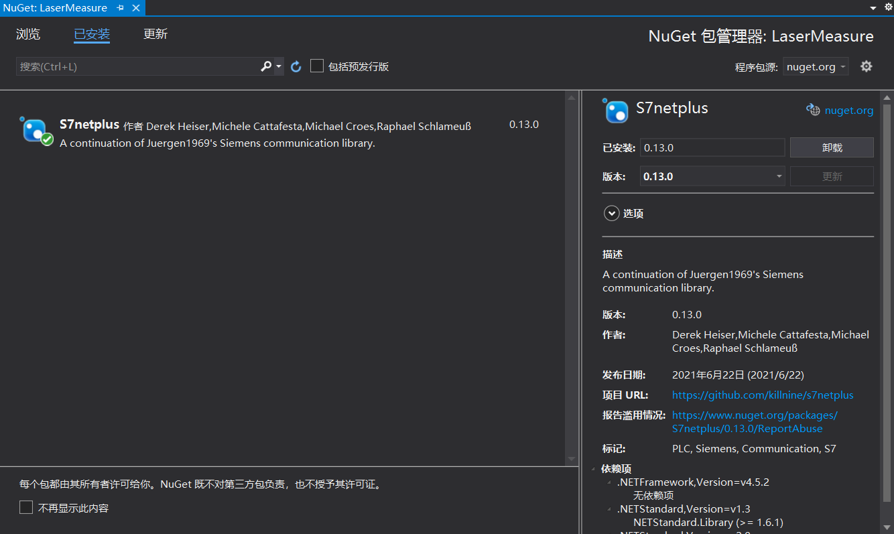

> 这章节内容包括
>
> * 从 .Net Framework 到 .Net Core 再到 .Net Terms
> * .Net 版本发布时间和长期支持问题（LTS）
> * 应用程序类型和应用
> * 开发人员工具
> * 使用 .Net CLI
> * 程序 "Hello World"
> * 创建 web 应用的技术

> 本章中的代码下载
>
> 本章的源代码可以在 www.wiley.com 的本书上找到。点击下载链接。代码也可以在 https://github.com/ProfessionalCSharp/ 上找到目录 `ProfessionalCSharp2021` 中的 `1_CS/HelloWorld` 。
>
> 本章的代码主要分为以下例子：
>
> ➤ HelloWorld
>
> ➤ WebApp
>
> ➤ SelfContainedHelloWorld

## 从 .Net Framework 到 .Net Core 再到 .Net 术语

.NET的第一个版本于2002年发布。自第一个版本以来，许多特性都发生了变化。.NET的第一个时代是.NET Framework，它为Windows桌面应用程序和Web应用程序提供了窗体开发。这个版本的.NET只适用于微软的Windows系统。当时，微软还在ECMA(https://www.ecma-international.org/publications/standards/Ecma-334.htm)上创造了一个c#的标准。

后来，Microsoft Silverlight 使用了这种技术的一个子集，并使用浏览器插件在浏览器中运行有限的库和运行时。当时，Ximian公司开发了Mono 运行时。这个运行时可用于Linux和Android，并提供了微软的一个子集。净的功能。后来，Novell收购了Ximian，后来又被附属集团收购。随着新团体对.NET失去兴趣，米格尔·德·伊卡扎(Ximian的创始人)创办了Xamarin，并将有趣的.NET部分带到他的新团体中，为安卓和iOS系统创建了.NET。如今，Xamarin属于微软，而Mono运行时是dotnet运行时 (https://github.com/dotnet/runtime）的一部分。

Microsoft Silverlight 开始为其他具有不同形式的设备开发.NET，这些设备对.NET有不同的需求。长期来看，Microsoft Silverlight 没有成功，因为HTML5提供了只能通过浏览器插件使用的特性。后来，Silverlight 开始转变方向，从而造就了.NET Core。

.NET Core是.NET自初始发布以来最大的变化。.NET 变成了开源代码，你可以为其他不同平台创建应用程序，而.NET的代码正在使用当代的设计模式。下一步是一个合乎逻辑的举动：继.NETCore3.1之后的.NET版本是.NET5。Core被删除，版本4被跳过，这意味着有一个比.Net Framework4.8更高的版本，是时候转移到.NET5来创建新的应用程序了。

> 可以在这篇文章里看.Net的发展历程：[[.NET大牛之路 003\] .NET 的发展简史 - 精致码农 - 博客园 (cnblogs.com)](https://www.cnblogs.com/willick/p/15038133.html#:~:text=2000 年末，微软发布第一个.NET Framework Beta 版本，紧接着在 2001 年初发布第一个.NET Framework,2006 年左右，微软相继推出了.NET Framework 的 2.0 和 3.0 版本。)

对于使用.NET Core的开发者来说，版本迁移很容易。对于开发好的应用程序，通常所有需要更改的都是目标框架的版本号。从.Net Framework中迁移应用程序并不是那么容易，而且可能需要进行更大的更改。根据应用程序类型，需要或多或少的更改。NET Core3.x支持WPF和Windows窗体应用程序。使用这些应用程序类型，更改可以很容易地实现。但是，现有的.Net Framework的WPF应用程序可能具有不易迁移的特性。例如，.NETCore和.NET5不支持应用程序域。迁移WCF（Windows Communication Foundation，Windows通信基础服务）到.NET5不是一件容易的事。WCF在新的.NET时代不在被支持。如果需要满足需求，WCF的部分需要重写为ASP.NET Core Web API，gRPC，或者其他通信技术。


### .Net 术语

在深入学习之前，您应该了解概念和一些重要的.NET术语，比如什么是.NET SDK，.NET运行时又是什么。您还需要更好地理解.Net Framework，以及何时使用.NET Standard，及NuGet包管理工具和.NET命名空间。


### .NET SDK

若要开发.NET应用程序，您需要安装.NET SDK。SDK包含.NET命令行接口(CLI)、工具、库和运行时。通过使用CLI，你可以基于模板、缓存包创建和构建应用程序并部署它。在本章后面的.Net CLI一节中，您将看到如何创建和构建应用程序。

如果您使用 VisualStudio2019，那么.NET SDK是作为Visual Studio的一部分安装的。如果您没有Visual Studio，您可以从https://dot.net安装SDK。在这里，您可以找到关于如何在Windows、Mac和Linux系统上安装SDK的说明。

您可以并行安装多个版本的.NET SDK。

```bash
dotnet --list-sdks
```


显示了在系统上安装的所有不同的SDK版本。默认情况下，使用最新版本

> **注意**：要运行该命令，您有许多不同的选项来启动命令提示符。一个是Windows内置命令提示符；您可以安装新的Windows终端；如果安装了VisualStudio，您可以启动开发人员命令提示符；也可以使用bash shell。在本章后面的“开发人员工具”部分阅读更多关于Windows终端的信息。

如果您不希望使用最新版本的SDK，则可以创建一个全局的.json文件。

```bash
dotnet new globaljson
```

在当前目录中创建文件global.json。此文件包含当前使用的版本号。您可以将版本号更改为已安装的其他SDK版本之一

```json
{
 "sdk": {
 "version": "5.0.406"
 }
}
```

在global.json及其子目录中，使用指定的SDK版本。你可以查看版本。

```bash
dotnet --version
```


### .NET 运行时

在目标系统上，不需要使用.NET SDK。在那里，您只需要安装.NET运行时。运行时包括所有的核心库和dotnet驱动程序。

dotnet驱动程序用于运行应用程序——例如，Hello，World应用程序

```bash
dotnet hello-world.dll
```

> 通过 `dotnet build` 可以打包程序。在 `bin/Debug/net6.0/` 中执行上述：
>
> 

在https://dot.net上，您不仅可以找到在不同平台上下载和安装SDK的说明，而且还可以找到运行时。

您还可以将运行时作为应用程序的一部分来交付（这称为自包含部署），而不是在目标系统上安装运行时。这种技术与旧的.Net Framework应用程序非常不同，将在“使用.NET CLI”一节的章节中介绍。

若要查看已安装了哪些运行时，您可以使用

```bash
dotnet --list-runtimes
```


### CLR（Common Langurage Runtime 公共语言运行库）

C#编译器将C#代码编译为Microsoft IL(Intermediate Language，中间语言)代码。这段代码有点像汇编代码，但它有更多的面向对象的特性。IL代码由公共语言运行时(CLR)运行。CLR做了什么？

IL代码由CLR编译为本机代码。.NET程序集中可用的IL代码是由一个即时编译器（JIT）编译的。这个编译器会创建特定于平台的本机代码。运行时包括一个名为RyuJIT的JIT编译器。这个编译器不仅比前一个编译器快，而且在使用Visual Studio调试应用程序时，它还更好地支持使用“编辑和继续”。

在创建了类型的实例之后，还需要销毁它们，并且需要回收内存。运行时的另一个特性是垃圾收集器。垃圾收集器将清除在托管堆中不再被引用的对象中的内存。

> **注意**：第17章“并行编程”中介绍了如何使用C#创建和管理线程。第13章，“托管和非托管内存”，提供了关于垃圾收集器和如何清理内存的信息。


### .Net 编译平台

作为SDK的一部分安装的C#编译器属于.NET编译器平台，该平台的代号是Roslyn。Roslyn允许您与编译过程进行交互，使用语法树，并访问由语言规则定义的语义模型。您可以使用Roslyn来编写代码分析器和重构特性。您还可以使用Roslyn和C#9的一个新特性，即代码生成器，这将在第12章“反射、元数据和源生成器”中讨论。


### .NET  Core

.NET Core是.Net最新的技术，这本书主要讲解其。（现在统一为.Net）这个框架是开源的，你可以在http://www.github.com/dotnet上找到它。

运行时是CoreCLR存储库；CoreFX存储库包含框架的集合类、文件系统访问权限、控制台、XML等内容。

与.Net Framework不同，应用程序所需要的.Net Core特定版本必须安装在系统上，要使用.NET Core1.0，框架，以及运行时，需要与应用程序一起交付。以前，在部署ASP.Net Web项目有时遇到问题。因为安装了旧版本的.NET；那种情况已经没有了。现在，您可以与应用程序一起交付运行时，并且不依赖于服务器上安装的版本。

.NET Core采用模块化的方法设计。该框架被分成一个大的NuGet软件包列表。这样您就不必处理所有的包，元包引用了较小的包一起工作。这甚至在.NET Core2.0和ASP.NET Core2.0中就得到了改进。使用 ASP.NET Core2.0，你只需要参考Microsoft.AspNetCore.All你所需要ASP.NET Web应用的所有的包。

.NET Core可以快速更新。即使是更新运行时，也不会影响现有的应用程序，因为运行时可以与应用程序一起安装。现在，微软可以通过更快的发布周期来改进.NET Core，包括运行时。

> 注意：为了使用.NET Core开发应用程序，微软创建了新的命令行实用程序工具。这将在后面使用*.NET CLI*在这一章中，通过一个“Hello,World” 应用程序展示出来。


### .Net

从.NET5开始，.NET Core有了一个新名字：.NET。从名称中删除“Core”意味着提醒那些仍然在使用.NET Framework的开发人员，从现在开始就没有一个新版本的.NET Framework了。.NET Framework已不再开发新的特性。对于新的应用程序，您应该使用.NET


### .NET Standard

.NET Standard是创建和使用库时的一个重要规范。.NET标准提供的是一个协议，而不是一个实现。根据此协议，列出了可用的api。对于每个新版本的.NET Standard，都会添加新的api。api永远不会被移除。例如，.NET Standard 2.1比.NET Standard 1.6列出了更多的api。


### NuGet 包管理工具

在早期，组件是应用程序的可复用单元。当您对程序集添加引用以使用自己代码中的公共类型和方法时，这种使用仍然是可能的（对于某些程序集是必要的）。然而，使用库不意味着仅仅是添加引用和使用它。使用库还可能意味着进行一些配置更改或使用脚本来利用某些特性。目标框架决定了您可以使用哪些二进制文件。这些是在NuGet中打包程序集的原因，这些包是包含程序集（或多个程序集）以及配置信息和PowerShell脚本的zip文件。

使用NuGet软件包的另一个原因是它们很容易被找到；它们不仅可以从微软获得，也可以从第三方获得。NuGet包在https://www.nuget.org的NuGet服务器上访问。

您可以使用.NET CLI将NuGet软件包添加到应用程序中：

```bash
 dotnet add package <package-name>
```

从VisualStudio项目的引用中，您可以打开NuGet程序包管理器（请参见图1-1）。在那里，您可以搜索软件包并将它们添加到应用程序中。此工具使您能够搜索尚未发布的包（包括预发布选项），并定义应该搜索的包。搜索包的一个地方可以是您自己的共享目录，即放置了您使用过的内部包。



**图 1-1**


### 命名空间

.NET中可用的类被组织在命名空间中。这些命名空间大多以System或Microsoft开头。下表介绍了一些命名空间，以提供有关层次结构的概念：

| 命名空间                                 | 描述                                                         |
| ---------------------------------------- | ------------------------------------------------------------ |
| System.Collections                       | 这是集合的根命名空间。集合也可以在子命名空间中找到。比如： System.Collections.Concurrent 和  System.Collections.Generic |
| System.Diagnostics                       | 这是诊断信息的根命名空间，例如事件日志记录和跟踪（在System.Diagnostics.Tracing里） |
| System.Globalization                     | 这是包含用于全球化和本地化的类的命名空间。                   |
| System.IO                                | 这是文件输入/输出（I/O）的名称空间，其中包括访问文件和目录的类。readers、writers和streams都在这里 |
| System.Net                               | 这是核心网络的命名空间，例如访问DNS服务器和使用System.Net.Sockets创建套接字。 |
| System.Threading                         | 这是线程和任务的根命名空间。Tasks是在System.Threading.Tasks中定义的。 |
| Microsoft.Data                           | 这是用来访问数据库的命名空间。Microsoft.Data.SqlClient 包含能访问Sql Server接口，早前在System.Data中的类已经被重新包装至Microsoft.Data |
| Microsoft.Extensions.DependencyInjection | Microsoft DI 命名空间                                        |
| Microsoft.EntityFrameworkCore            | 为了访问关系数据库和非关系型数据库，可以使用实体框架核心。类型将在此命名空间中定义。 |


## .Net 版本发布时间和长期支持问题（LTS）

当你在使用.Net工作时，你应该知道版本的不同支持周期，.NET版本根据当前或长期支持LTS的名称而有所不同。LTS版本至少支持三年，或在下一个LTS版本可用后为一年。例如，如果下一个LTS版本在上一个版本发布后2.5年可用，而前一个版本的支持长度为3.5年。

当前版本在下一个版本出现后仅被支持三个月。在撰写本文时，.NETCore2.2和3.0是已经不再支持安全和热修复的当前版本，而.NETCore2.1和3.1是仍然支持的LTS版本。下表列出了.NETCore和.NET版本及其发布日期、支持级别和终止日期

| .NET CORE/.NET 版本 | 发布日期      | 支持级别 | 终止日期                                |
| ------------------- | ------------- | -------- | --------------------------------------- |
| 1.0                 | June 27, 2016 | LTS      | June 27, 2019                           |
| 1.1                 | Nov. 16, 2016 | LTS*     | June 27, 2019                           |
| 2.0                 | Aug. 14, 2017 | Current  | Oct. 1, 2018                            |
| 2.1                 | May 30, 2018  | LTS      | Aug. 21, 2021                           |
| 2.2                 | Dec. 4, 2018  | Current  | Dec. 23, 2019                           |
| 3.0                 | Sep. 23, 2019 | Current  | Mar. 3, 2020                            |
| 3.1                 | Dec. 3, 2019  | LTS      | Dec. 3, 2022                            |
| 5.0                 | Nov. 10, 2020 | Current  | around Feb. 2022                        |
| 6.0                 | Nov. 2021     | LTS      | Nov. 2024                               |
| 7.0                 | Nov. 2022     | Current  | 2024年2月或更早的时间，以防次要版本发布 |
| 8.0                 | Nov. 2023     | LTS      | Nov. 2026                               |

从.NET5开始，这些版本就会变得更加可预测。每年11月，都会有新的主要发布。每两年，发布的是LTS版本。

根据您正在工作的环境，您可能会决定使用LTS或当前版本。对于当前版本，您可以更快地获得新特性，但您需要更频繁地升级到较新的版本。当应用程序处于活动开发阶段时，您可能会决定使用当前版本。随着您的应用程序变得越来越稳定，您可以切换到下一个LTS版本。

如果您已经开始使用持续集成/持续交付(CI/CD)进行开发，那么只使用当前版本并更快地接收新特性可能是一件容易的工作。


## 应用程序类型和应用

您可以使用C#来创建控制台应用程序；对于本书的第一章中的大多数代码示例，都是这么做的。对于许多程序，控制台应用程序并不那么频繁使用。您可以使用C#来创建使用与.NET相关联的许多技术的应用程序。本节概述了可以用c#编写的不同类型的应用程序。


### 数据存取

在查看应用程序类型本身之前，让我们来看看所有应用程序类型用于访问数据的技术。

文件和目录可以通过使用简单的API调用来访问；但是，对于某些场景，简单的API调用还不够灵活。使用Stream API，提供了更多的灵活，并且流提供了更多的特性，比如加密或压缩。readers和writers让使用流变得更容易。在第18章“文件和流”中涵盖了这里所有不同的选项。

要读取和写入数据库，您可以使用一个抽象层，即实体框架核心（第21章，“实体框架核心”）。实体框架核心提供了一个对象层次结构到数据库关系的映射。EF Core（**Entity Framework Core**，实体框架核心）不仅提供使用不同的关系数据库，而且还支持NoSQL数据库，如Azure Cosmos DB。


### Windows 应用

对于创建窗体应用程序，您可以使用新的UI控件WinUI 3.0来创建通用窗体平台(UWP)或窗体桌面应用程序。UWP应用程序使用了一个沙箱环境，其中应用程序需要根据所使用的api向用户请求权限。桌面应用程序版本可以与WPF和Windows窗体应用程序相比，其中几乎所有的.NET5 apis都可以使用。WPF和窗体应用程序也可以更新，以使用新的现代WinUI控件。

使用MVVM模式创建具有XAML代码的WinUI应用程序将在第30章“具有XAML应用程序的模式”以及后面的章节中介绍。

> **注意**：创建WinUI应用程序详见第30章，其中介绍了XAML、不同的XAML控件和应用程序的生命周期。通过支持MVVM模式，您可以使用WinUI、WPF、UWP、Xamanrin平台和Maui创建应用程序。第30章将介绍此模式。要创造很酷的外观和风格的应用程序，请务必阅读第31章，“造型窗口应用程序”。最后，第32章“高级Windows应用程序”深入介绍了Windows应用程序的一些高级功能。
